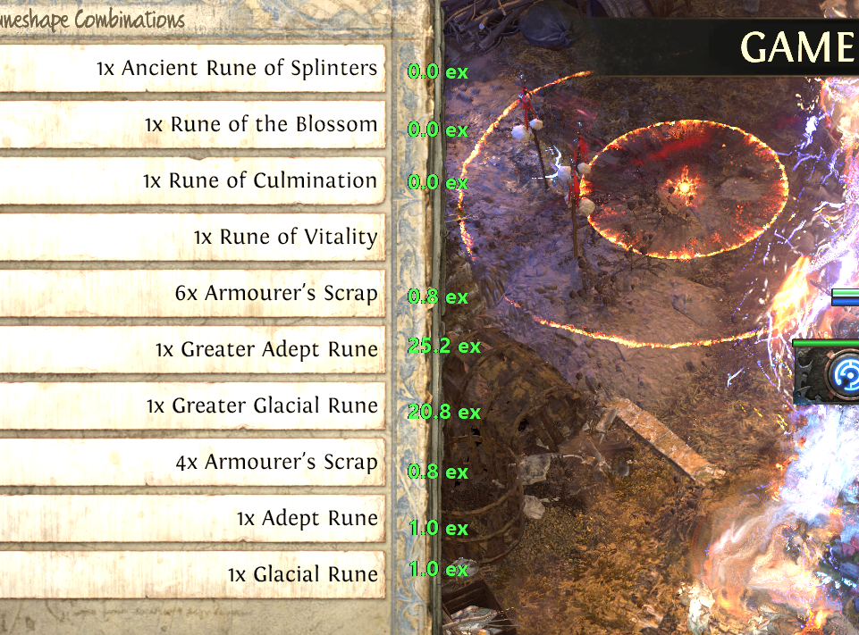
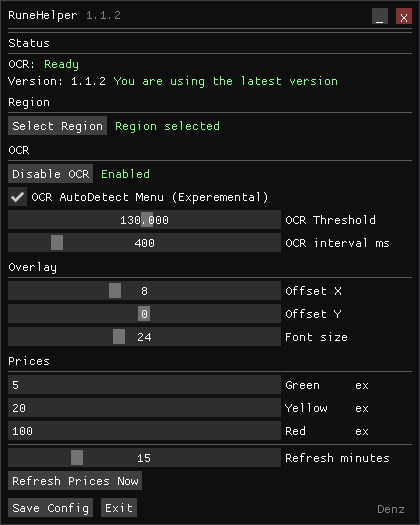

# RuneHelper

A lightweight overlay tool for **Path of Exile 2** that uses **OCR (Tesseract)** to detect item names on the screen and display their current market prices.


## Features

* Select any loot area on the screen.
* Real-time OCR using Tesseract.
* Fuzzy matching for OCR mistakes.
* Overlay displaying item prices next to detected items.
* Automatic price cache updates.
* Offline cache (`prices_dump.json`) to reduce API requests.
* No game memory reading or injection.

## Screenshot




## How it works

1. Select the loot area on your screen.
2. RuneHelper periodically captures the selected region.
3. Tesseract extracts item names.
4. OCR mistakes are corrected using fuzzy matching.
5. Prices are loaded from cache or downloaded from the API.
6. An overlay is rendered next to the items.

## Dependencies

* C++20
* OpenCV
* Tesseract OCR
* cpr
* nlohmann/json

Installed via vcpkg:

```powershell
vcpkg install opencv:x64-windows
vcpkg install tesseract:x64-windows
vcpkg install cpr:x64-windows
vcpkg install nlohmann-json:x64-windows
vcpkg install imgui[dx11-binding,win32-binding]:x64-windows
```

With static libs:
```powershell
vcpkg install opencv:x64-windows-static
vcpkg install tesseract:x64-windows-static
vcpkg install cpr:x64-windows-static
vcpkg install nlohmann-json:x64-windows-static
vcpkg install imgui[dx11-binding,win32-binding]:x64-windows-static
```

## Building

```powershell
git clone https://github.com/Denzeriko/RuneHelper.git
cd RuneHelper

cmake -B build -DCMAKE_TOOLCHAIN_FILE=C:/vcpkg/scripts/buildsystems/vcpkg.cmake

cmake --build build --config Release
```

## Price API

Prices are fetched from:

```text
https://poe2scout.com/api/poe2/Leagues/runes/Items
```

The cache is stored in:

```text
prices_dump.json
```

The dump is refreshed automatically every 15 minutes.

## Known Issues

* OCR may occasionally misread small italic text.
* Item names with unusual fonts may require fuzzy matching.
* Multi-monitor setups are not heavily tested.

## Disclaimer

This project:

* does **not** inject into the game;
* does **not** read game memory;
* only captures a user-selected screen region and performs OCR on the image.

## License

MIT License.
