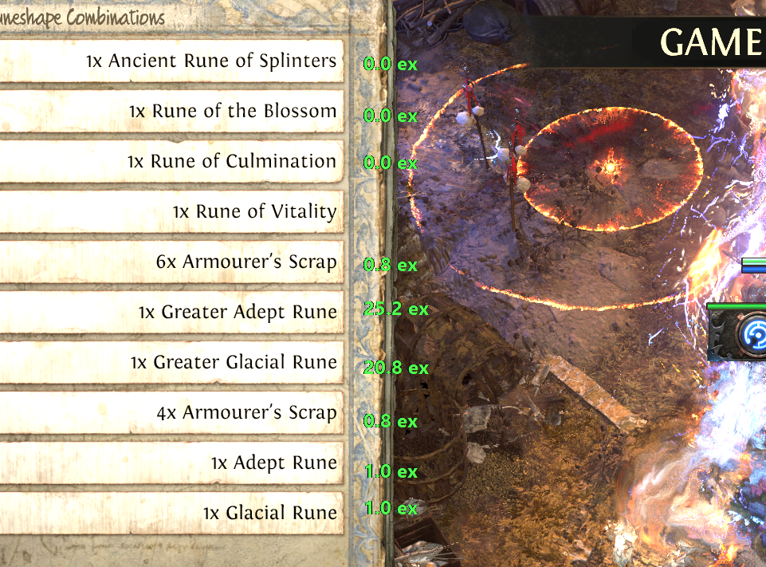

# RuneHelper

A lightweight overlay tool for **Path of Exile 2** that uses **OCR (Tesseract)** to detect item names on the screen and display their current market prices.


[](https://github.com/Denzeriko/RuneHelper/actions/workflows/msbuild.yml?query=branch%3Amaster)
[](https://github.com/Denzeriko/RuneHelper/actions/workflows/linux-build.yml?query=branch%3Amaster)

## Download

[](https://github.com/Denzeriko/RuneHelper/actions/workflows/msbuild.yml?query=branch%3Amaster)
[](https://github.com/Denzeriko/RuneHelper/actions/workflows/linux-build.yml?query=branch%3Amaster)

Open the latest successful workflow run and download the artifact from the **Artifacts** section.

## Features

* Select any loot area on the screen.
* Real-time OCR using Tesseract.
* Single-pass OCR tuned for the Runeshape loot menu.
* Fuzzy matching for OCR mistakes.
* Overlay displaying item prices next to detected items.
* Automatic price cache updates.
* League-specific offline price cache to reduce API requests.
* Debug window showing OCR and matching results.
* Optional OCR debug image/text dumps.
* No game memory reading or injection.

## Screenshot



## How to use

Click **Select Region**, then drag a rectangle around the Runeshape loot list. This only needs to be done once; RuneHelper saves the selected region in its config. Select it again only if the game window, UI scale, or menu position changes.


## How it works

1. Select the loot area on your screen.
2. RuneHelper periodically captures the selected region.
3. The OCR pipeline finds text rows in the right side of the Runeshape loot menu.
4. Each detected row is cropped, binarized, and passed to Tesseract.
5. OCR mistakes are corrected using fuzzy matching.
6. Prices are loaded from cache or downloaded from the API.
7. An overlay is rendered next to the detected items.

## OCR Debug

Enable **Debug OCR** in the UI to write the latest OCR inputs and recognition logs to:

```text
Windows: %APPDATA%\Denz\RuneHelper\ocr_debug\latest
Linux:   ~/.config/RuneHelper/ocr_debug/latest
```

The folder is overwritten on each OCR run and may contain:

* `source.png` - captured source region.
* `rows_detected.png` - detected text rows and crop start markers.
* `row_XX_row.png` - detected row crop.
* `row_XX_text.png` - text crop sent to OCR preprocessing.
* `row_XX_bin.png` - binarized image passed to Tesseract.
* `row_XX_bin.txt` - raw OCR text, trimmed text, confidence, and accept/reject status.

## Dependencies

* C++20
* OpenCV
* Tesseract OCR
* cpr
* nlohmann/json
* ImGui

## Building on Windows

Installed via vcpkg:

```powershell
vcpkg install opencv:x64-windows
vcpkg install tesseract:x64-windows
vcpkg install cpr:x64-windows
vcpkg install nlohmann-json:x64-windows
vcpkg install imgui[dx11-binding,win32-binding]:x64-windows
```

## Building on Ubuntu

The Linux build targets X11 or Wayland, chosen at configure time with `RUNEHELPER_LINUX_BACKEND` (`x11` by default).

The Wayland backend draws its overlay and region selector through `wlr-layer-shell`, which both wlroots compositors and KWin implement. For screen capture it picks a path at runtime:

* `wlr-screencopy` when the compositor offers it (Hyprland, Sway, river, labwc) — captures just the configured region, with no permission prompt;
* `xdg-desktop-portal` ScreenCast over PipeWire otherwise (KDE Plasma) — the desktop asks once which monitor to share, and the answer is remembered in `~/.config/RuneHelper/screencast_token`.

Share the monitor that contains the capture region: the portal gives the app a single output and the app cannot choose it for you. If the wrong monitor is shared, the log says which output arrived and which region was expected, and the saved permission is dropped so the picker opens again.

Setting `RUNEHELPER_CAPTURE_PORTAL=1` forces the portal path on compositors that also support `wlr-screencopy`, which is useful for reproducing KDE behaviour.

GNOME is not supported: it implements neither `wlr-layer-shell` nor `wlr-screencopy`, so the overlay has nowhere to live.

### Install dependencies

```bash
sudo apt update
sudo apt install \
    build-essential \
    cmake \
    pkg-config \
    libopencv-dev \
    libtesseract-dev \
    libleptonica-dev \
    libblas-dev \
    liblapack-dev \
    libx11-dev
```

For the Wayland backend, add:

```bash
sudo apt install \
    libwayland-dev \
    wayland-protocols \
    libxkbcommon-dev \
    libdbus-1-dev \
    libpipewire-0.3-dev
```

> **Note:** `libtesseract-dev` provides the C++ API, while `libleptonica-dev` is required by Tesseract.

### Configure and build

```bash
cmake -S . -B build -DCMAKE_BUILD_TYPE=Release
cmake --build build -j$(nproc)
```

For Wayland:

```bash
cmake -S . -B build -DCMAKE_BUILD_TYPE=Release -DRUNEHELPER_LINUX_BACKEND=wayland
cmake --build build -j$(nproc)
```

## Building with Docker (Arch Linux)

The Dockerfile produces a self-contained binary: OpenCV, Leptonica, Tesseract, GLFW, cpr and libstdc++ are linked statically, leaving only glibc, libcurl, the display server client libraries and libGL dynamic.

```bash
docker build --network host --output out .
```

The binary lands in `out/RuneHelper`. `--network host` keeps pacman and the FetchContent clones on the host routes; without it the Arch mirrors tend to time out inside the build container. The backend defaults to Wayland and is switched with a build argument:

```bash
docker build --network host --build-arg RUNEHELPER_LINUX_BACKEND=x11 --output out .
```

The Linux build embeds `eng.traineddata_fast` and the rune templates into the executable the same way the Windows resource script does, so the binary runs from any working directory:

```bash
./out/RuneHelper
```

## Global hotkeys on Wayland

Wayland lets no client grab keys globally, so the Wayland build listens on a control socket at `$XDG_RUNTIME_DIR/runehelper.sock`. Starting the binary with a command forwards it to the running instance and exits:

```bash
RuneHelper --toggle-ocr
RuneHelper --snapshot
RuneHelper --select-region
```

Bind them in the compositor config, for example in `hyprland.conf`:

```text
bind = , F8, exec, /path/to/RuneHelper --toggle-ocr
bind = , F9, exec, /path/to/RuneHelper --snapshot
bind = , F10, exec, /path/to/RuneHelper --select-region
```

## Price API

Prices are fetched from:

```text
https://poe.ninja/poe2/api/economy/exchange/current/overview?league=LEAGUE&type=TYPE
```

The cache is stored in the RuneHelper app data directory as a league-specific dump:

```text
Windows: %APPDATA%\Denz\RuneHelper\prices_dump_<league>.json
Linux:   ~/.config/RuneHelper/prices_dump_<league>.json
```

The dump is refreshed automatically every 15 minutes.

## Known Issues

* The Wayland backend needs `wlr-layer-shell`, so GNOME Wayland sessions are not supported.
* On KDE the portal asks which monitor to share; it has to be the one holding the capture region.
* Wayland has no global key grabs: hotkeys go through the control socket and a compositor binding.

## Disclaimer

This project:

* does **not** inject into the game;
* does **not** read game memory;
* only captures a user-selected screen region and performs OCR on the image.

## License

MIT License.
