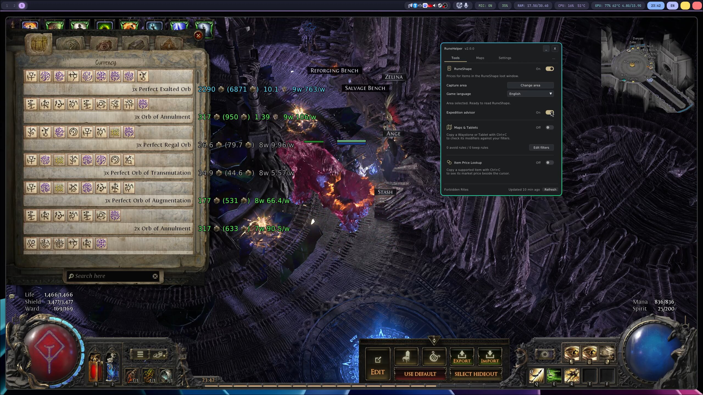

# RuneHelper

An overlay companion for **Path of Exile 2**: RuneShape prices, Expedition advice, map filters and item price lookup. Available for **Windows and Linux**.

Reads game text in **9 languages**: English, Русский, Deutsch, Français, Español, Português, 한국어, 日本語 and ไทย. The app interface is in English.

[Website](https://denz.pw/runehelper) · [Download](https://github.com/Denzeriko/RuneHelper/releases/latest) · [Report an issue](https://github.com/Denzeriko/RuneHelper/issues)


[](https://github.com/Denzeriko/RuneHelper/actions/workflows/msbuild.yml?query=branch%3Amaster)
[](https://github.com/Denzeriko/RuneHelper/actions/workflows/linux-build.yml?query=branch%3Amaster)



## Features

| Tool | What it does |
| --- | --- |
| **RuneShape** | Reads the loot list with OCR and displays prices beside each item, with currency icons and configurable price colors. Handles HDR, dimmed images and 4K capture regions. |
| **Expedition advisor** | Compares rune combinations by reward value per monster wave. Can show rune names and highlight rare tiles. Includes an offline recipe database with automatic updates. |
| **Maps & Tablets** | Checks copied Waystones and Tablets against **Keep / Avoid** rules. Supports numeric thresholds for properties and modifiers, search, and a persistent last copied item for editing filters. |
| **Item Price Lookup** | Shows prices for supported items from the poe.ninja database in Exalted and Divine Orbs when you copy them with **Ctrl+C**. Works independently of RuneShape OCR. |

* **Overlay appearance:** separate font size, background and text outline for each tool, with a live preview. Maps can appear beside the cursor or in a selected area; Item Prices appear beside the cursor. Cursor panels stay within the screen and hide when the pointer moves.
* **Market data:** league selection, automatic refresh and a local price cache. Data comes from poe.ninja through `denz.pw`, with a direct fallback.
* **Desktop controls:** configurable OCR hotkeys, pause when the game is inactive on Windows/X11, and minimize to tray on Windows.
* **Updates and diagnostics:** update notifications on the Tools page, in-app installation, OCR and copied-item diagnostics, and bug report export.

RuneHelper reads screen captures and copied item text. It does not read game memory or inject into the game.

## Download

Get a binary from [Releases](https://github.com/Denzeriko/RuneHelper/releases/latest):

| File | System |
| --- | --- |
| `RuneHelper-windows-x86_64.exe` | Windows 10 or newer |
| `RuneHelper-linux-x86_64-wayland` | Supported Wayland desktops, including Hyprland, Sway and KDE Plasma |
| `RuneHelper-linux-x86_64-x11` | X11 desktops |

Linux releases require glibc 2.35 or newer. Make the downloaded file executable:

```bash
chmod +x RuneHelper-linux-x86_64-wayland
```

## Quick start

1. In **Settings > General**, select your league. Enable the tools you want on **Tools**.
2. For **RuneShape**, choose your game language and click **Select area**. Drag around the RuneShape loot list; the capture area is saved. Enable **Expedition advisor** for combination advice.
3. For **Maps & Tablets** or **Item Price Lookup**, hover an item in the game and press **Ctrl+C**. Clipboard checking also works while RuneHelper is minimized.


**F8** toggles OCR, **F9** reads once, and **F10** selects the capture area. Change them in **Settings > Hotkeys**. Overlay styling and map panel placement are under **Settings > Appearance**.

### Map filters

Copy a Waystone or Tablet, then open **Maps**. Search its properties or modifiers and click **+ Keep** or **+ Avoid**. Saved rules appear at the top, with editable values and comparisons: `>`, `>=`, `<`, `<=`, `=`. Avoid modifiers can also match **at any value**.

**All Keep conditions must pass; any Avoid match rejects the item.** Matching lines are green or red. The copied item remains in the editor after the overlay disappears.

Plain and advanced copied text are supported. The clipboard language is detected automatically; filters use the language in which they were created, so recreate them if you change the game language.

## Linux notes

* **Wayland:** requires `wlr-layer-shell`; GNOME Wayland is not supported. Clipboard tools need `ext-data-control-v1` or `wlr-data-control-unstable-v1`. Cursor placement uses XWayland and XRandR.
* **KDE Plasma:** screen capture may ask you to select a monitor. Choose the one containing the capture area.
* **Fonts:** Japanese, Korean and Thai text needs matching system fonts, such as Noto Sans CJK and Noto Sans Thai.
* **Hotkeys on Wayland:** bind the app's commands in your compositor. For Hyprland:

```text
bind = , F8, exec, /path/to/RuneHelper --toggle-ocr
bind = , F9, exec, /path/to/RuneHelper --snapshot
bind = , F10, exec, /path/to/RuneHelper --select-region
```

These commands forward the action to the running instance and exit.

## Troubleshooting

Open **... > Diagnostics** for capture, OCR, Expedition and copied-item details. For recognition problems, leave the relevant game panel visible and click **Create Bug Report**. Attach the generated ZIP to a GitHub issue. **Save OCR Debug** exports the capture and recognition results separately.

Settings, logs and price caches are stored in:

* Windows: `%APPDATA%\Denz\RuneHelper`
* Linux: `~/.config/RuneHelper` (or `$XDG_CONFIG_HOME/RuneHelper`)

See [architecture.md](architecture.md) for the OCR pipeline, threading and platform implementation.

## Building

Clone with submodules:

```bash
git clone --recurse-submodules https://github.com/Denzeriko/RuneHelper.git
cd RuneHelper
```

### Docker (Linux)

```bash
docker build --output out .
```

This exports the Wayland binary to `out/RuneHelper`. For X11:

```bash
docker build --build-arg RUNEHELPER_LINUX_BACKEND=x11 --output out .
```

<details>
<summary>Native Windows build</summary>

Requires Visual Studio with the C++ Clang tools and vcpkg. From a Developer PowerShell:

```powershell
$env:VCPKG_ROOT = "C:\path\to\vcpkg"
cmake --preset windows-clang-release
cmake --build --preset windows-clang-release
```

Output: `build/windows-clang-release/RuneHelper.exe`.

</details>

<details>
<summary>Native Linux build</summary>

Requires C++20, OpenCV, cpr, nlohmann/json, Dear ImGui and GLFW. Bundled submodules provide cpr, GLFW and Dear ImGui when needed.

Ubuntu dependencies:

```bash
sudo apt install build-essential cmake git pkg-config libopencv-dev \
    libcurl4-openssl-dev libssl-dev libglfw3-dev libgl1-mesa-dev \
    libx11-dev libxrandr-dev libxfixes-dev libxext-dev
```

For Wayland, also install:

```bash
sudo apt install libwayland-dev wayland-protocols libxkbcommon-dev \
    libdbus-1-dev libpipewire-0.3-dev
```

```bash
cmake -S . -B build -DCMAKE_BUILD_TYPE=Release
cmake --build build -j$(nproc)
```

The default backend is X11. Add `-DRUNEHELPER_LINUX_BACKEND=wayland` to configure a Wayland build.

</details>

## Credits and license

The RuneShape combination database and poe2db scraper come from [imbermuda/expeditionWiz](https://github.com/imbermuda/expeditionWiz), used with the author's permission.

[MIT License](LICENSE.txt).

## Support

If RuneHelper helps you, you can support its development with a BTC donation.

**Bitcoin (BTC):**
`bc1qkxfpyjv46uayg06qyznkgp7r0qw8zmk0lth33a`
